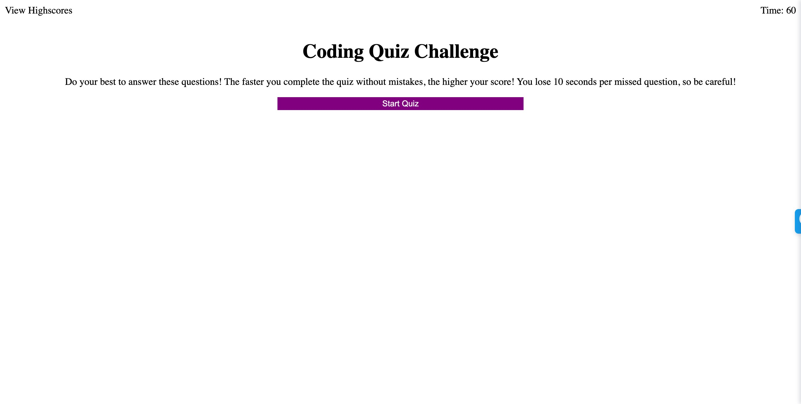

# Homework4 Web APIs: Code Quiz

## Description

I created a code quiz.  Upon clicking 'Start Quiz', a user will be directed to a number of questions.  They click an answer choice to submit their answer, and they are then directed to another question and eventually the conclusion page once they are finished.  The quiz is timed, and the goal is to have the highest score possible. When a user answers a question incorrectly, they lose 10 seconds from the timer. The game is over once all questions are answered or the timer reaches 0. At the end of the game, the user can enter their initials and save their score to local memory. At any point, the user can click 'View Highscores' to see the last high score entered. 

## Screenshot

[Screenshot](Assets/Code_Quiz_Screenshot.jpeg)

## Deployed Application

[Deployed Application](https://samrapow.github.io/homework4-web-APIs-code-quiz/Develop/index.html)